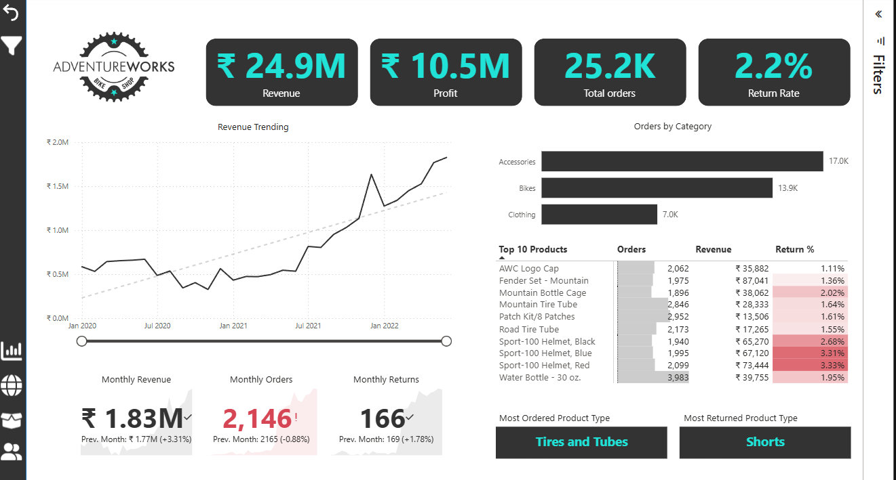

# 🧭 AdventureWorks Sales Performance Dashboard  
### *Power BI | Business Analytics | Data Visualization*

---

## 📊 Project Overview  
This dashboard provides a comprehensive analysis of **AdventureWorks’ sales performance** across multiple product categories — *Accessories, Bikes,* and *Clothing*.  
The goal was to design an **interactive, insight-driven Power BI report** to help management track key metrics, identify high-performing products, and uncover trends in revenue, profit, and returns.

---

## 🎯 Business Objectives  
- Monitor **Revenue, Profit, and Orders** over time.  
- Compare **product category performance** to optimize strategy.  
- Identify **top-selling** and **most-returned** products.  
- Analyze **monthly trends** to support decision-making.  

---

## 💡 Key Insights  
✅ **Total Revenue:** ₹24.9M with ₹10.5M in Profit — a strong margin.  
📈 **Orders Trend:** 25.2K total orders with steady growth since 2020.  
🛒 **Category Analysis:**  
- **Accessories** lead in order volume (17K orders).  
- **Bikes** contribute more significantly to overall revenue.  
🔁 **Returns:** Overall return rate of **2.2%**, with *Shorts* having the highest (3.33%).  
🏆 **Most Ordered Product:** *Tires and Tubes* — showing consistent customer demand.  

---

## ⚙️ Tools & Technologies Used  
| Tool / Language | Purpose |
|------------------|----------|
| 🧩 **Power BI** | Data modeling, visualization & dashboard creation |
| 📊 **Microsoft Excel / CSV (AdventureWorks Dataset)** | Data source |
| 🧮 **DAX (Data Analysis Expressions)** | KPI and measure calculations |

---

## 📈 Dashboard Features  
- 📌 **Dynamic KPIs:** Revenue, Profit, Orders, and Return Rate  
- 📆 **Monthly Trends:** Revenue & Orders with comparison vs. previous month  
- 🧱 **Category Analysis:** Visual breakdown by product type  
- 🧾 **Top Products:** Table with heatmap for return rate  
- 🎚️ **Interactive Filters:** Slice data by time, category, and product  

---

## 🧠 Skills Demonstrated  
- Data Cleaning & Modeling  
- DAX for Business Calculations  
- Visual Analytics & Data Storytelling  
- Dashboard UI/UX Design  
- Business Performance Reporting  

---

## 🖼️ Dashboard Preview  

---

## 🚀 How to Use  
1. Download the `.pbix` file from this repository.  
2. Open it using **Power BI Desktop (latest version)**.  
3. Interact with visuals and slicers to explore insights.  

---

## 🔮 Future Improvements  
- Add **regional-level sales analysis** (Geo map visualization).  
- Perform **customer segmentation (RFM analysis)**.  
- Implement **forecasting visuals** using Power BI analytics tools.  
- Connect to a **live SQL database** for real-time reporting.  

---

## 👤 About the Author  
**👋 Prateek Pal**  
🎓 *MBA – Business Analytics* | Aspiring *Business Analyst*  
💡 Passionate about transforming data into actionable insights  

📧 **Email:** [your-email@example.com]  
🌐 **LinkedIn:** [your-linkedin-profile](https://www.linkedin.com/in/prateek-pal-22au1/)  
💻 **GitHub:** [PrateekPal](https://github.com/iprateekpal)

---

⭐ *If you found this project interesting, feel free to star this repository and connect with me on LinkedIn!*  
